# TrackBallBar
TrackBallBarは、「今あるキーボードにトラックボールとスクロールホイールを、ついでに拡張性を」をコンセプトに作成した有線トラックボールです。

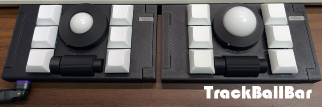

## 特徴
- 完成品ですぐに使えます。追加で必要なのはUSB-Cケーブルのみです。
- 有線式でバッテリーを気にする必要がありません。(デメリットでもあります。)
- トラックボールとスクロールホイールがあります。
- トラックボールは19mm球、25mm球が使えます。
- トラックボールはベアリング支持で、軽い力で動きます。(若干うるさいです。)
- LEDインジケータがあり、発光色で使用レイヤーがわかります。
- Vialによるカスタマイズが可能です。8レイヤーまで対応します。
- 絶対座標モードとそれを利用した疑似マルチカーソル機能があります。
- MX互換キースイッチの交換が可能です。
- 19mm球使用時で30.9mm、25mm球で36.6mm(実測)の高さです。 
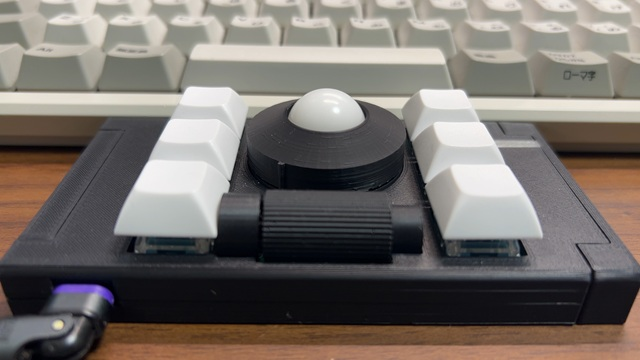
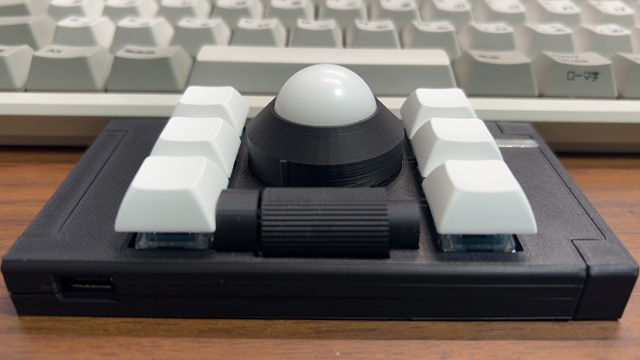

## パッケージ内容
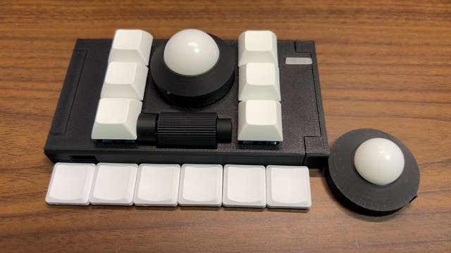
- TrackBallBar本体 1台
- 25mm POM球(取付済) 1個
- ミネベアミツミ製ミニチュアベアリングDDL-630ZZ(内径3mm、外径6mm、厚さ2.5mm) 3個(取付済)
- 3×8mm ステンレス平行ピンh7 3個(取付済)
- 25mm球用ボールカバー 1個(取付済)
- Yushakobo Fairy Silent Linear Switch(MX互換静音キースイッチ 35g) 6個(取付済)
- DSAキーキャップ 白 6個(取付済)
- 3M製 しっかりつくクッションゴム 8φ×2mm CS-102 6個(取付済)
- 19mm POM球 1個
- 19mm球用ボールカバー 1個
- Tai-Hao Thinsキーキャップ 白 6個

## サイズ
- 幅: 118mm
- 奥行: 64mm
- 高さ: 30.9mm(19mm球使用時)/36.6mm(25mm球使用時)

## 内部仕様
- MCU: RP2040
- Flash: Winbond W25Q128JVSIQ(16MB)
- Sensor: PixArt Imaging PMW3360
- Support DPI: 300-3000dpi
- LED: SK6812-MINI-E
- Firmware: vial-qmk

## 各部名称
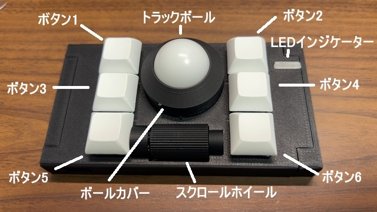
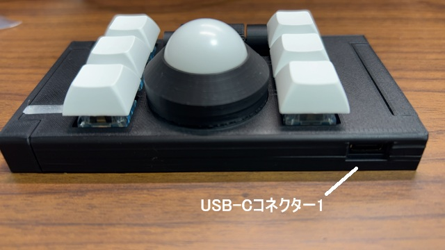
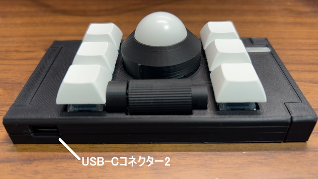
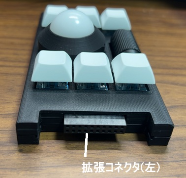
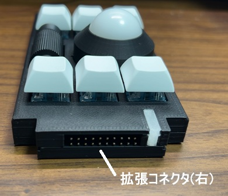
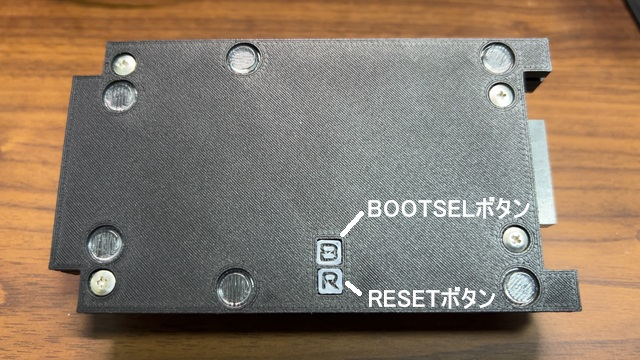

## 使用上の注意
- ケースなどは3Dプリンターによる自家製です。細かい傷などありましても、ご容赦ください。
- ケースなどはPLAで作成しています。50度ほどで変形しますので、温度には注意してください。
- スクロールホイールの軸は3Dプリントしたもので、強度が高くありません。強い力を加えると折れることがあるので、注意してください。
- USB-Cコネクタが２つありますが、同時には接続しないでください。TrackBallBarだけでなく、接続した機器の破損の恐れがあります。
- 拡張ユニットの接続はUSB-Cケーブルを抜いた状態で行ってください。TrackBallBarだけでなく、接続した機器の破損の恐れがあります。

## LEDインジケーター
現在のレイヤーを発光色で示します。他にも設定値の確認にも使用します。
- レイヤー1: 白
- レイヤー2: 緑
- レイヤー3: 青
- レイヤー4: 水
- レイヤー5: 黄
- レイヤー6: 橙
- レイヤー7: ピンク
- レイヤー8: 赤

## トラックボールサイズの変更方法
1. ボールカバーを逆時計回りに回し、出っ張りが正面にきたところで上に持ち上げて外します。
2. 3つのベアリングを小型のマイナスドライバーで下から持ち上げ外します。
3. ベアリングを使用するボールの箇所に取り付けます。取り付けるときは、ベアリングのシャフトの両端を同時に押してはめ込んでください。
- 19mm球のベアリング位置 
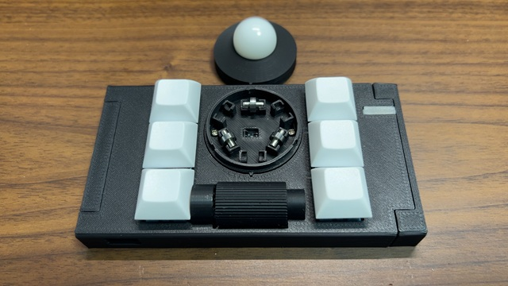
- 25mm球のベアリング位置 
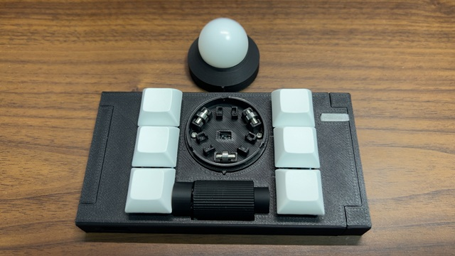
4. 使用するボール用のボールカバーを取り付けます。取り付けるときは出っ張りを正面にしてはめ込み、時計回りで回してください。
5. お好みでキーキャップを交換してください。

## キースイッチの交換
キースイッチソケットを使用しており、キースイッチを交換することができます。キースイッチを上に引き抜いてください。
交換できるのはMX互換のキースイッチです。

## デフォルトのキーマップ

- ボタン1: 左クリック
- ボタン2: 左クリック
- ボタン3: DPI半減(押している間)
- ボタン4: スクロールホイール切り替え(押している間、垂直スクロールから水平スクロールに切り替え)
- ボタン5: 右クリック
- ボタン6: 右クリック
- ボタン1+ボタン2: DPI確認
- ボタン5+ボタン6: DPI調整
- ボタン1+ボタン3: 疑似マルチカーソル切り替え(絶対座標モード)
- ボタン2+ボタン4: 相対座標／絶対座標モード切り替え
- ボタン3+ボタン4: トラックボールセンサー角度変更(4方向)
- スクロールホイール上: 垂直スクロール上 / 水平スクロール左
- スクロールホイール下: 垂直スクロール下 / 水平スクロール右

## トラックボールセンサーの角度変更
ボタン3とボタン4を同時に押すことでトラックボールセンサーの角度を変更します。 
ボタンを押すごとに90度回転します。 
ボタンを押したときのLEDインジケーターの発光色で現在の角度が確認できます。
- 白: 0度
- 緑: 90度
- 青: 180度
- 赤: 270度

## DPI調整
ボタン5とボタン6を同時に押したまま、スクロールホイールを操作することでDPI調整できます。DPIの調整範囲は300-3000DPIです。
- スクロールホイール上: DPIアップ(+100 DPI)
- スクロールホイール下: DPIダウン(-100 DPI)

LEDインジケーターが白点滅すれば受理、赤点滅すれば上限/下限であることを示します。 
ボタン1とボタン2を同時に押すと、現在のDPIをLEDインジケーターで確認できます。 
以下の発光色の点灯回数でDPIを確認します。
- 緑: 1000DPI
- 青: 100DPI

## 絶対座標モード／疑似マルチカーソル機能
絶対座標モードは、通常の相対座標モードと異なり、TrackBallBar内でマウスカーソルの座標を管理します。 
本機能を正確に動作させるには、Vialでスクリーンサイズの設定が必要になります。 
絶対座標モードでは、カーソルの移動は等速となり、OS側の加速度設定は有効になりません。 
また、相対座標モードと絶対座標モードでは、別々のDPIとなります。 
ボタン2とボタン4を同時に押すことで、相対座標モードと絶対座標モードが切り替えられます。 
切り替え時のLEDインジケータの発光色で、どちらのモードか確認できます。
- 青: 相対座標モード
- 赤: 絶対座標モード

絶対座標モードでは、疑似マルチカーソル機能が使用できます。
TrackBallBar内にマウスカーソルの座標を2～5個保持し、切り替えることができます。
疑似マルチカーソル機能の使用時は、自動的に絶対座標モードに切り替わります。
疑似マルチカーソルの数は、Vialで設定できます。
ボタン1とボタン3を同時に押すことで、疑似マウスカーソルの切り替えができます。
切り替え時のLEDインジケータの発光色で、現在のマウスカーソルが確認できます。
- 1番目: 白
- 2番目: 緑
- 3番目: 青
- 4番目: 水
- 5番目: 黄

絶対座標モードはペン入力の方式でカーソルを操作しています。 
アプリケーションがペン入力に対応している場合、マウスとペンで異なるカーソルとなり、
マウスボタンの入力座標がカーソルと異なる位置になることがあります。 
この場合は、アプリケーション側でペン入力の機能を無効化してください。 
例: Excel

## X軸／Y軸ロック機能
X軸／Y軸ロック機能は、トラックボール操作で、X軸やY軸を固定化し、
その軸の移動を行わなくする機能です。 
この機能を使用するには、Vialで機能ボタン(LockX,LockY)を割り当てる必要があります。 
切り替え時のLEDインジケータの発光色で、現在の状態が確認できます。
- アンロック: 青
- ロック: 赤

## Vialによるカスタマイズ
カスタマイズはVial(https://get.vial.today/)で行えます。 
Vial自体の使用方法の説明はいたしません。

### キーマップ
TrackBallBarでは、特殊なキーマップになっています。 
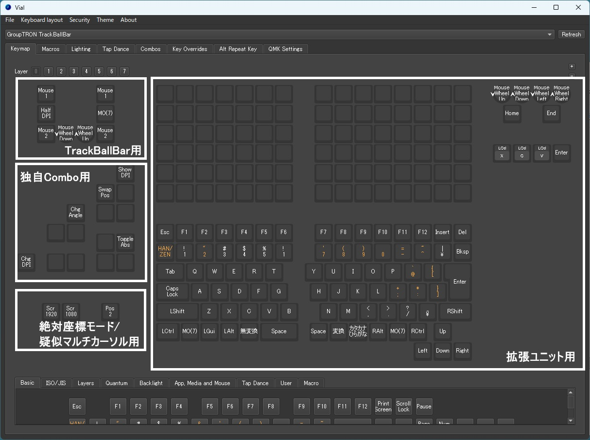
- TrackBallBar用 
TrackBallBar用のボタン／スクロールホイールをカスタマイズする領域です。
- 拡張ユニット用 
拡張ユニット用のボタン／ホイールをカスタマイズする領域です。 
拡張ユニットごとに使用する領域が指定されます。
- 独自Combo用 
独自コンボ機能を参照してください。
- 絶対座標モード／疑似マルチカーソル用 
絶対座標モード／疑似マルチカーソル機能を参照してください。

### 初期キーマップ
- レイヤー0 
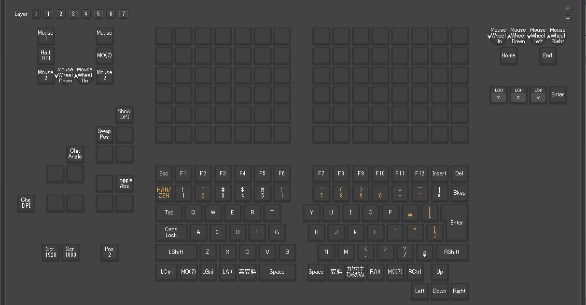
- レイヤー1 

- レイヤー2 
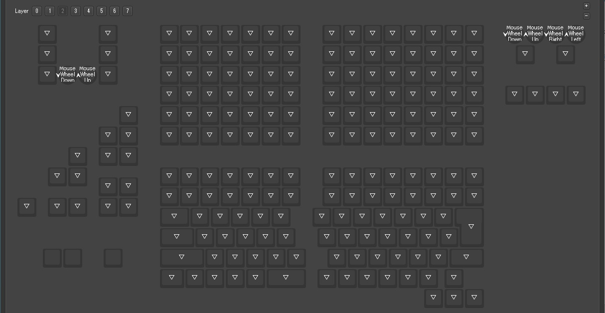
- レイヤー3 
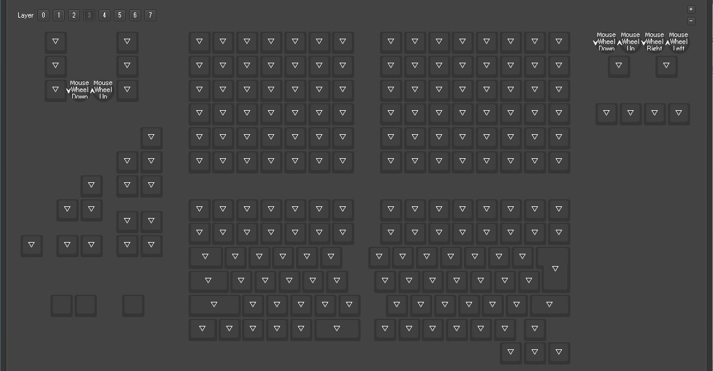
- レイヤー4 

- レイヤー5 

- レイヤー6 

- レイヤー7 
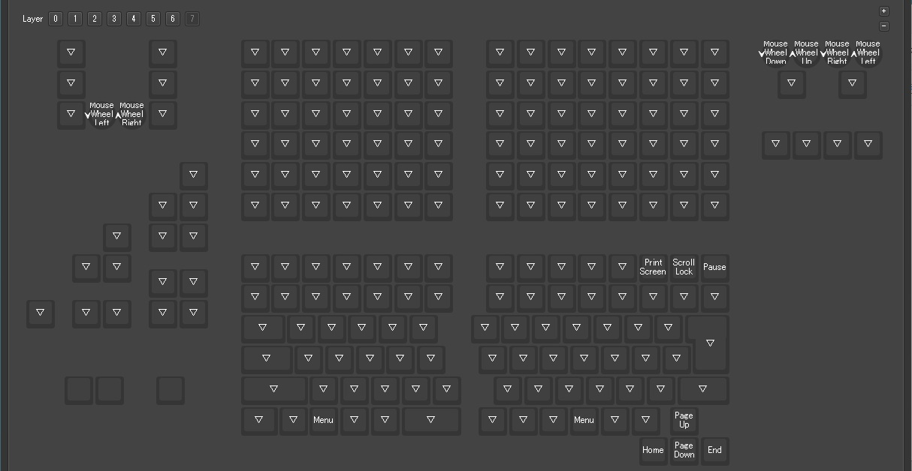

### 固有キー
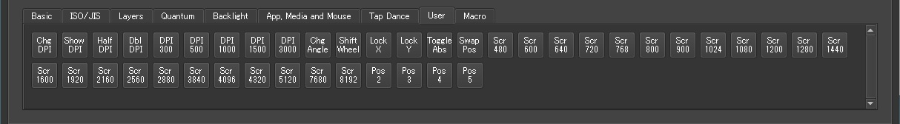

UserタブにあるTrackBallBar固有のキーです。

| キー名      | 機能 |
| ---------- | ------------------------------------------------ |
| ChgDPI     | DPIを変更します。本キーを押したまま、スクロールホイールを動かすことでDPIを±100します。 |
| ShowDPI    | 現在のDPIをLEDインジケーターで確認します。 |
| HalfDPI    | 押している間、DPIを半分にします。 |
| DblDPI     | 押している間、DPIを２倍にします。 |
| DPI300     | DPIを300に変更します。 |
| DPI500     | DPIを500に変更します。 |
| DPI1000    | DPIを1000に変更します。 |
| DPI1500    | DPIを1500に変更します。 |
| DPI3000    | DPIを3000に変更します。 |
| ChgAngle   | トラックボールセンサーの角度を変更します。押すごとに90度回転します。 |
| ShiftWheel | 押している間、トラックボールの操作をホイールに切り替えます。 |
| LockX      | トラックボールの操作でX軸方向の移動をロック／アンロックします。 |
| LockY      | トラックボールの操作をY軸方向の移動をロック／アンロックします。 |
| ToggleAbs  | 相対座標モード／絶対座標モードを切り替えます。(絶対座標モード／疑似マルチカーソル機能を参照) |
| SwapPos    | 疑似マルチカーソル機能を有効にし、マウスカーソルの位置を切り替えます。(絶対座標モード／疑似マルチカーソル機能を参照) |
| ScrXXXX    | スクリーンサイズ指定用です。通常のキーへの割り当ては無効です。(絶対座標モード／疑似マルチカーソル設定を参照) |
| PosX       | 疑似マルチカーソル機能の疑似カーソル数の指定用です。通常のキーへの割り当ては無効です。(絶対座標モード／疑似マルチカーソル設定を参照) |

### 独自コンボ機能
QMKによるコンボ機能とは別に、独自にコンボ機能を作成しています。 
(QMKでは同じキーの同時押しによるコンボができそうになかったため) 
コンボの配置は以下のようになっています。

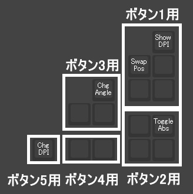
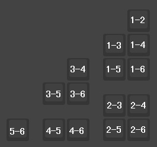

### 絶対座標モード／疑似マルチカーソル設定
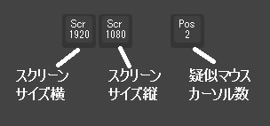 
絶対座標モード／疑似マルチカーソル機能で使用するスクリーンサイズ、疑似マルチカーソル数を設定します。 
スクリーンサイズに指定できるのは、UserにあるScrXXXXで、それ以外を指定した場合、デフォルト値(1920x1080)になります。 
ぴったりの値がない場合は、より近い値を指定してください。 
疑似マルチカーソル数に指定できるのは、UserになるPosXで、それ以外を指定した場合、デフォルト値(2)になります。 
なお、Layer0の設定値のみ有効です。

### LEDインジケーターの調整
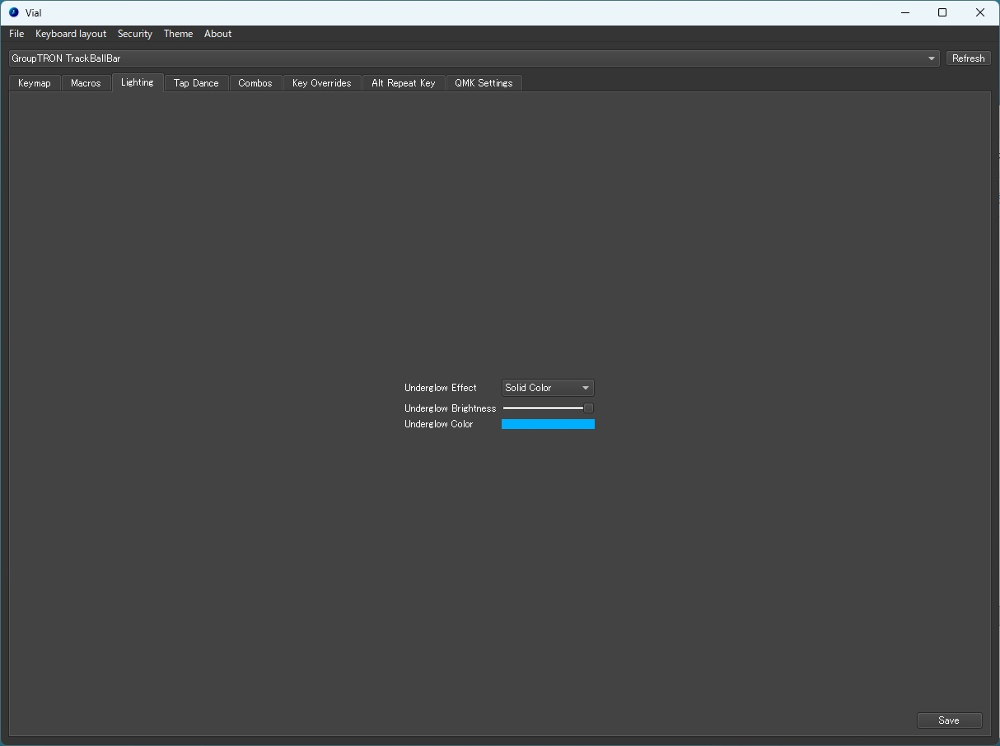

VialのLightingタブでの調整はできません。 
効果があるのは、Underglow Effectを"All Off"にすることでのLEDインジケーターの無効化のみです。 
ただし、以下の操作をするとLEDインジケーターが点灯します。その際には再設定してください。
- DPIの変更
- DPI確認
- トラックボールセンサーの角度変更
- X軸ロック／アンロック
- Y軸ロック／アンロック
- 相対座標モード／絶対座標モードの切り替え
- 疑似マルチカーソルの切り替え

## 拡張ユニット自作向け情報
### コネクタ
2.54mmピッチの10×2(20)ピンのピンヘッダ、ピンソケットを使用します。

### ピンアサイン
#### 拡張コネクタ左(10x2ピンソケット)

|20|18|16|14|12|10|8|6|4|2|
|----|----|----|----|----|----|----|----|----|----|
|19|17|15|13|11|9|7|5|3|1|

#### 拡張コネクタ右(10x2ピンヘッダ)
|2|4|6|8|10|12|14|16|18|20|
|----|----|----|----|----|----|----|----|----|----|
|1|3|5|7|9|11|13|15|17|19|

#### ピン内容
1. ロータリーエンコーダ No.3 ピン2
2. ロータリーエンコーダ No.3 ピン1
3. ロータリーエンコーダ No.2 ピン2
4. ロータリーエンコーダ No.2 ピン1
5. colrow18
6. colrow17
7. colrow16
8. colrow15
9. colrow14
10. colrow13
11. colrow12
12. GND
13. colrow11
14. colrow10
15. colrow9
16. colrow8
17. colrow7
18. colrow6
19. colrow5
20. 3.3V

※3.3Vはありますが、RP2040と共用であり、あてにしないでください。

### マトリクス
改良二乗マトリクスを使用します。 
ピンからの入力とピンへの出力のそれぞれにダイオード(1N4148など)が必要です。

例: 
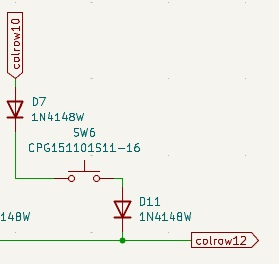

使用できるキーマップは下図の領域です。 
マトリクスの番号はcolrowで、上が入力、左が出力です。 
※キーボードユニットの領域のマトリクスは複雑なので、使用をお勧めしません。 
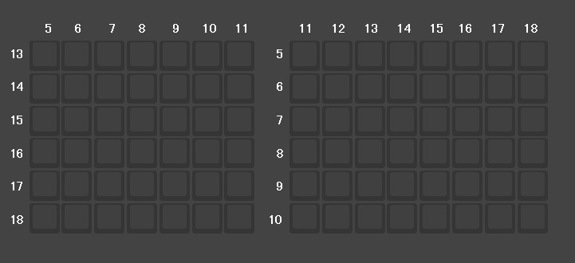

## ファームウェア
### ファームウェア変更方法
1. Vial(アプリ版)で現在の設定をファイルに保存してください。
2. 背面のRESETボタンを２回連続で押してください。
3. "RPI-RP2"ディスクが接続されますので、ファームウェアをコピーしてください。
4. Vial(アプリ版)で1のファイルを反映してください。 
(ファームウェアの変更内容によっては反映できないことがあります。)

### ファームウェア履歴
| version            | 説明  | ファームウェア                                                                                | ソース      |
| ------------------ | --- | -------------------------------------------------------------------------------------- | -------- |
| 1.0.0 (2026/3/20) | 初版  | 3/20公開予定 | 3/20公開予定 |
